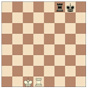

<h1 align="center">Шахматы</h1>

В проекте реализованы основные правила и сущности игры в шахматы.  
Так в программе реализованы следующие фигуры: 

- ♚ Король (King);  
- ♛ Ферзь (Queen);  
- ♜ Ладья (Rook);  
- ♝ Слон (Bishop);  
- ♞ Конь (Horse);  
- ♟ Пешка(Pawn).  

Начальная позиция фигур на шахматной доске такова:  

  

## Ходы фигур
### Король (King)
![king_logo][1] ![king_logo_black][2]  

Существует два различных способа делать ход королем:  
- Пойти на любое соседнее поле;  

  

- Сделать «рокировку». Это перемещение короля и одной из ладей
  того же цвета по первой от игрока горизонтали, считающееся за один ход
  короля, выполняется следующим образом: король перемещается со своего
  начального поля на два поля по направлению к одной из ладей
  того же цвета, стоящей на начальном поле, затем эта ладья перемещается на поле,
  которое король только что пересек:  

  

Право на рокировку теряется если король или одна из ладей, с которой осуществляется рокировка
уже делали ход.

### Ферзь (Queen)
![queen_logo_white][3] ![queen_logo_black][4]  

Ферзь может пойти на любое поле по вертикали, горизонтали или
диагонали, на которых он стоит.  

  

При выполнении хода ферзь **не может** перейти
через поля, занятые другими фигурами.

### Ладья (Rook)  
![rook_logo_white][5] ![rook_logo_black][6]  

Ладья может пойти на любое поле по вертикали или горизонтали, на
которых она стоит.  

  

При выполнении хода ладья **не может** перейти
через поля, занятые другими фигурами.

### Слон (Bishop)
![bishop_logo_white][7] ![bishop_logo_black][8]  

Слон может пойти на любое поле по диагонали, на которой он стоит.  

  

При выполнении хода слон **не может** перейти
через поля, занятые другими фигурами.

### Конь (Horse)
![horse_logo_white][9] ![horse_logo_black][10]  

Конь может пойти на одно из полей, ближайших к тому, на котором он
стоит, но не на той же самой горизонтали, вертикали или диагонали.  

  

При выполнении хода конь **может** перейти
через поля, занятые другими фигурами.  

### Пешка(Pawn)  
![pawn_logo_white][11] ![pawn_logo_black][12]  

Пешка может пойти вперед на поле, расположенное непосредственно
перед ней на той же самой вертикали, при условии, что это поле не занято.
При своем первоначальном ходе пешка также может пойти на два поля по той же
самой вертикали, при условии, что оба эти поля не заняты. 
Пешка может пойти на поле, занятое фигурой соперника,
расположенное перед ней по диагонали на соседней вертикали, забирая эту
фигуру.  

  

Пешка, занимающая поле на той же горизонтали и на соседней
вертикали с пешкой соперника, которая только что продвинулась на два поля
в один ход от своей первоначальной позиции, может взять эту продвинутую
пешку соперника, как если бы последний ее ход был только на одно поле. 
Это взятие возможно только ходом, следующим за этим
продвижением, и называется взятием «на проходе» ("En passant").  

Когда игрок при своем ходе продвигает пешку на самую дальнюю
от исходного положения горизонталь, он должен заменить эту пешку, и это
является частью того же хода, на нового ферзя, ладью, слона или коня того
же цвета на предназначенном для пешки поле. Это поле называется полем
«превращения» ("Pawn Promotion").  

[1]: https://upload.wikimedia.org/wikipedia/commons/thumb/7/7e/Chess_piece_-_White_king.jpg/100px-Chess_piece_-_White_king.jpg
[2]: https://upload.wikimedia.org/wikipedia/commons/thumb/f/f1/Chess_piece_-_Black_king.JPG/100px-Chess_piece_-_Black_king.JPG
[3]: https://upload.wikimedia.org/wikipedia/commons/thumb/a/af/Chess_piece_-_White_queen.jpg/122px-Chess_piece_-_White_queen.jpg
[4]: https://upload.wikimedia.org/wikipedia/commons/thumb/d/d3/Chess_piece_-_Black_queen.JPG/122px-Chess_piece_-_Black_queen.JPG
[5]: https://upload.wikimedia.org/wikipedia/commons/thumb/f/fe/Chess_piece_-_White_rook.JPG/100px-Chess_piece_-_White_rook.JPG
[6]: https://upload.wikimedia.org/wikipedia/commons/thumb/1/19/Chess_piece_-_Black_rook.JPG/100px-Chess_piece_-_Black_rook.JPG
[7]: https://upload.wikimedia.org/wikipedia/commons/thumb/1/1d/Chess_piece_-_White_bishop.JPG/100px-Chess_piece_-_White_bishop.JPG
[8]: https://upload.wikimedia.org/wikipedia/commons/thumb/b/ba/Chess_piece_-_Black_bishop.JPG/100px-Chess_piece_-_Black_bishop.JPG
[9]: https://upload.wikimedia.org/wikipedia/commons/thumb/3/31/Chess_piece_-_White_knight.JPG/100px-Chess_piece_-_White_knight.JPG
[10]: https://upload.wikimedia.org/wikipedia/commons/thumb/f/ff/Chess_piece_-_Black_knight.JPG/100px-Chess_piece_-_Black_knight.JPG
[11]: https://upload.wikimedia.org/wikipedia/commons/thumb/e/ed/Chess_piece_-_White_pawn.JPG/100px-Chess_piece_-_White_pawn.JPG
[12]: https://upload.wikimedia.org/wikipedia/commons/thumb/7/7e/Chess_piece_-_Black_pawn.JPG/100px-Chess_piece_-_Black_pawn.JPG